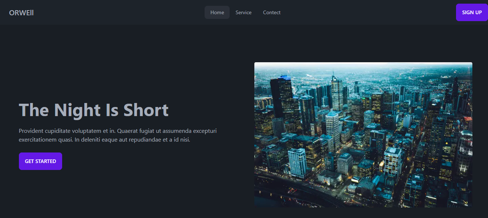
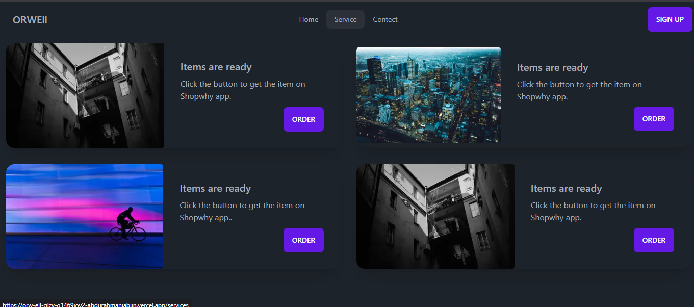
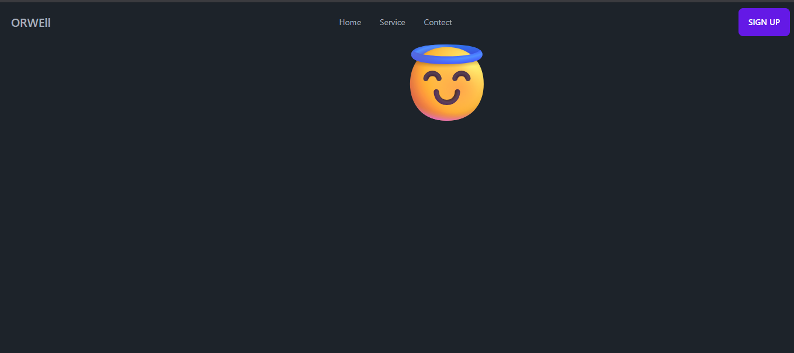
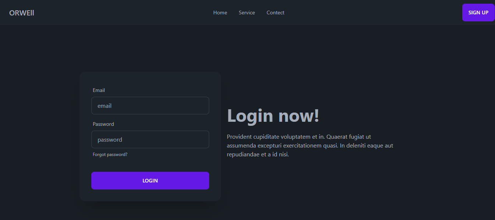

ORWEll
A sleek, modern landing page built with Next.js and Tailwind CSS, featuring a cohesive dark-themed UI and responsive layouts.

🚀 Live Demo

............

✨ Features
Modern Dark UI: A consistent dark-themed aesthetic with vibrant purple accents.

Multi-Page Navigation: includes Home, Services, and Contact routes.

Interactive Components: Includes a styled Login/Sign-up interface.

Responsive Design: Optimized for various screen sizes using Tailwind's utility-first approach.

🛠️ Tech Stack
Framework: Next.js (App Router)

Styling: Tailwind CSS

Deployment: Vercel

📸 Screenshots

